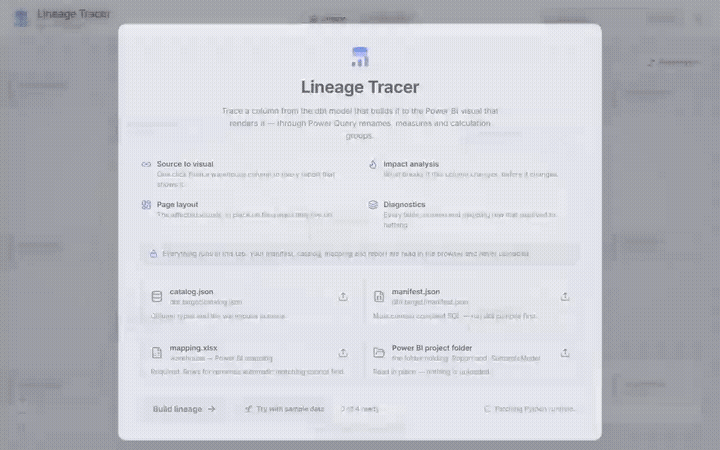
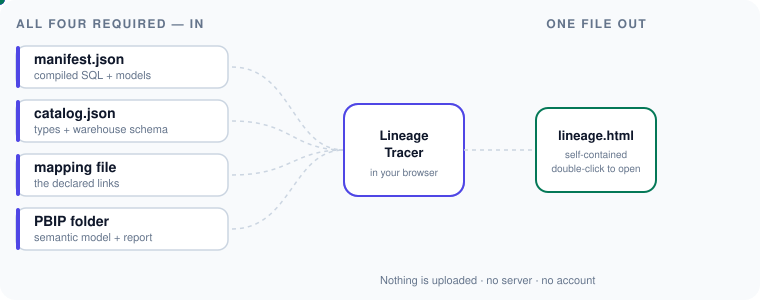

<!-- HOSTED-URL:START — replace every occurrence of the placeholder below with the GitHub Pages URL -->
<h1>Lineage Tracer</h1>

<a href="https://methunt.github.io/lineage-tracer/" target="_blank" rel="noopener noreferrer">
  <picture>
    <source media="(prefers-color-scheme: dark)" srcset="assets/hero-dark.svg">
    
  </picture>
</a>
<!-- HOSTED-URL:END -->

 

### Change a column in dbt, and know — before you change it — exactly which Power BI visuals break.

 

<picture>
  <source media="(prefers-color-scheme: dark)" srcset="assets/strip-why-dark.svg">
  
</picture>

<!-- DEMO:START -->

<!-- DEMO:END -->

<!-- HOSTED-URL:START -->
<a href="https://methunt.github.io/lineage-tracer/" target="_blank" rel="noopener noreferrer">
  <picture>
    <source media="(prefers-color-scheme: dark)" srcset="assets/cta-dark.svg">
    
  </picture>
</a>
<!-- HOSTED-URL:END -->

---

<h2>Where to start</h2>

 

| | You are here to… | Go to |
|---|---|---|
| 🧰 | **Get a graph out of it today** | [Part 1 · The four files](#-part-1) — then [the mapping file](#-part-2), which is the part people skip. |
| 🕸️ | **See what it actually renders** | [Part 3 · Lineage canvas](#-part-3) → [Part 4 · Impact](#-part-4) → [Part 5 · Page layout](#-part-5) |
| 🩺 | **Find out why something did not link** | [Part 6 · Diagnostics](#-part-6) — fourteen sections, each row linking back into the graph. |
| 🔒 | **Clear it with your security reviewer** | [Privacy](#-privacy) and [SECURITY.md](SECURITY.md), which lists what it deliberately does **not** protect against. |
| 🧠 | **Understand how it is built** | [How it is wired](#-wired) |

<picture>
  <source media="(prefers-color-scheme: dark)" srcset="assets/tour-inputs-dark.svg">
  
</picture>

---

<h2>The gap between two good tools</h2>

  

 

dbt and Power BI each have good lineage tools, and both stop at the warehouse
boundary — the one place a column's story crosses systems. Today that gap is
crossed by hand.

| | 🐢 By hand, today | ⚡ With Lineage Tracer |
|---|---|---|
| **"What breaks if I rename this column?"** | Grep the repo, open the PBIX, click through pages, hope. | Select the column. Everything off its path dims, and the panel gives the exact downstream measure and visual counts. |
| **"This visual is blank — where does its field come from?"** | Ask whoever built the model, if they still work here. | Walk the chain the other way: visual → measure → table → column → model → source, with the compiled SQL, DAX and M at each hop. |
| **"Which semantic model columns have no dbt column behind them?"** | Unanswerable at any useful scale. | A named list in Diagnostics, alongside thirteen other checks. |
| **"This measure looks unused — can I drop it?"** | It appears in no visual, so you drop it, and a slicer three pages away stops working. | Fields reached only through a field parameter are traced like any other, so "used by nothing" means it. |
| **Confidence in the answer** | A guess you cannot show anyone. | Declared links (your mapping rows) and derived links (parsed) are drawn differently and labelled. |
| **Where your data goes** | Screenshots into chat, extracts into a shared drive. | Nowhere. Files are read in the browser. |
| **Sharing the result** | A screenshot with no context. | One self-contained `.html` file you can email. |

---

<h2>Who this is for</h2>

<picture>
  <source media="(prefers-color-scheme: dark)" srcset="assets/section-who-light.svg">
  
</picture>

 

| | Persona | What you get out of it |
|---|---|---|
| 🛠️ | **Analytics engineer** | The pre-change answer. Blast radius on a real graph before you touch the model, banded **High / Medium / Low**, with raw counts always visible. |
| 📊 | **BI developer** | The post-break answer. Start at the broken visual and walk back to the model that owns the field, reading the actual DAX and M on the way. |
| 🧭 | **Data platform lead** | The boundary audit. Which semantic tables have no warehouse source, which join keys have no dbt column, which wide-reach columns have no dbt test. |
| 🔍 | **Reviewer or auditor** | An exportable artifact: one HTML file, no server, that shows how a number reached a page. |

---

<h2>Part 1 — The four files it needs</h2>

<picture>
  <source media="(prefers-color-scheme: dark)" srcset="assets/section-inputs-light.svg">
  
</picture>

 

| | Slot | What to give it | Why it is needed |
|---|---|---|---|
| 🧾 | **`manifest.json`** | Your dbt project's `target/manifest.json` | The models, the tests, and the **compiled SQL** the column lineage is read out of. |
| 🗄️ | **`catalog.json`** | Your dbt project's `target/catalog.json` | Real column types and the warehouse schema behind each model. |
| 📊 | **Mapping file** | A `.csv` with the headers described below | The links no amount of parsing can derive: renames, native SQL, an intervening view. **[Full detail below.](#-part-2)** |
| 📁 | **Power BI project folder** | The PBIP project root, holding `<name>.SemanticModel` and `<name>.Report` | The semantic model and the report, read in place. |

> [!WARNING]
> **The manifest must contain compiled SQL.** A parse-only manifest is
> structurally perfect and yields no lineage *inside* dbt. The app checks for
> compiled SQL at the moment you pick the file and says so on the slot, rather
> than after the extraction.

> [!TIP]
> **Filenames do not matter.** The two dbt artifacts are told apart **by content**
> — dbt's own `metadata.dbt_schema_version` when it wrote one, otherwise the shape
> (`parent_map`/`macros` for a manifest, per-node `stats` for a catalog). Drop the
> catalog into the manifest slot and it is refused on the spot with the sentence
> that actually fixes it: *the two slots are the wrong way round*.

---

<h2>Part 2 — The mapping file</h2>

<picture>
  <source media="(prefers-color-scheme: dark)" srcset="assets/section-mapping-light.svg">
  
</picture>

 

> [!IMPORTANT]
> **Nothing works without it.** It is the fourth required slot, not an optional
> extra, and it is the only place a human can assert a link that no parser could
> ever derive: a column renamed in Power Query, a table fed by native SQL, a view
> sitting between the mart and the model.

**What it is:** a `.csv` with these headers.
`From` is always the warehouse relation dbt builds; `To` is always the Power BI
object. Header matching is case- and spacing-insensitive.

| | Column | Required | Holds |
|---|---|---|---|
| 🗃️ | `From Database` | ✅ | The warehouse database dbt builds into. |
| 📂 | `From Schema` | ✅ | The schema of the relation. |
| 📋 | `From Table` | ✅ | The relation dbt builds. |
| 🔤 | `From Column` | ➖ | Warehouse-side column name — only for a genuine rename. |
| 🧱 | `To Table` | ✅ | The semantic model table. |
| 🔡 | `To Column` | ➖ | Power BI–side column name — only for a genuine rename. |

**Two shapes of row:**

| From Database | From Schema | From Table | From Column | To Table | To Column | Meaning |
|---|---|---|---|---|---|---|
| `ANALYTICS` | `marts` | `fct_sales` | *(blank)* | `Sales` | *(blank)* | 📗 **Table-level.** Columns auto-match by name. |
| `ANALYTICS` | `marts` | `dim_customer` | `cust_key` | `Customer` | `CustomerID` | 📘 **Column-level.** Use only for genuine renames. |
| `ANALYTICS` | `marts` | `dim_customer` | `cust_key` | `Customer` | *(blank)* | 📕 **Rejected.** Both column cells must be filled or both blank — reported, never guessed at. |

> [!TIP]
> **Where the rows come from:** build once with an empty-of-rows mapping file, then
> read the Diagnostics tab. *Semantic model tables with no warehouse source* is
> exactly the worklist of rows worth writing. Build again.

**Declared beats derived, always.** A mapping row is a human assertion and is
drawn as a **dashed** edge marked *declared*; a parsed match is drawn as a
**solid** edge marked *derived*. Where both exist, the declared row wins — and
you can see on the canvas which one you are looking at.

---

<h2>How it is wired</h2>

<picture>
  <source media="(prefers-color-scheme: dark)" srcset="assets/section-wired-light.svg">
  
</picture>

 

<picture>
  <source media="(prefers-color-scheme: dark)" srcset="assets/architecture-dark.svg">
  
</picture>

Two extractors and one join, all of it inside the page. The dbt side runs
[dbt-colibri](https://github.com/b-ned/dbt-colibri)'s column-lineage extractor as
real Python, on a WebAssembly runtime with a vendored `sqlglot`. The Power BI side
runs the PBIP parsers over TMDL, DAX, M and PBIR. The join reads the M query back
to the warehouse relation it names and matches that against what dbt builds.

---

<h2>Part 3 — The lineage canvas</h2>

<picture>
  <source media="(prefers-color-scheme: dark)" srcset="assets/section-lineage-light.svg">
  
</picture>

 

<picture>
  <source media="(prefers-color-scheme: dark)" srcset="assets/tour-trace-dark.svg">
  
</picture>

| | What | The question it answers |
|---|---|---|
| 🔽 | **Table nodes expand to columns** | "Which column, specifically?" Selecting one dims everything except its path, all the way through to the visuals. |
| 🧭 | **Navigation rail, two tabs** — Stage and Database | "Where does this thing live?" Stage is the pipeline order; Database is `database → schema → table`, as the warehouse holds it. |
| 🔍 | **Search palette** — <kbd>Ctrl</kbd>+<kbd>K</kbd> / <kbd>⌘</kbd>+<kbd>K</kbd> | "Where is `customer_key`?" Across models, columns, measures, visuals and pages — a node and one of its columns are separate results with separate actions. |
| 📄 | **Side panel** — Overview, Definition, Metadata | "What *is* this?" Compiled SQL, DAX or M, with the authored M shown next to what the tool resolved it to. Tab labels follow the node's own vocabulary. |
| 🌗 | **Light and dark** | The canvas, the rail and the panel all follow one theme toggle in the header. |

---

<h2>Part 4 — Impact analysis</h2>

<picture>
  <source media="(prefers-color-scheme: dark)" srcset="assets/section-impact-light.svg">
  
</picture>

 

Blast radius and breakage are kept strictly separate, because conflating them is
how a lineage tool loses its reader.

| | Concept | How it is decided |
|---|---|---|
| 📏 | **Blast radius** | Exact graph traversal — "12 measures and 4 visuals downstream". Never estimated. |
| 🚦 | **Bands** | Purely a function of the downstream **visual** count: **High ≥ 10**, **Medium ≥ 3**, **Low ≥ 1**. The raw counts are always shown next to the band, and the thresholds are stated in the panel. |
| 🔑 | **Join keys** | A column used as a relationship key gets a **floor** on its band, never a promotion above what its visual count already earns — and the panel says which of the two set it. |
| 🧨 | **`BROKEN`** | Shown only where the artifacts prove it: a visual referencing a field that does not exist. |
| 🚫 | **No heuristic `CRITICAL`** | Severity is never inferred. A tool that flags a healthy measure loses its reader the first time they check. |

**Select a table** for the union across its columns — *"if I drop this model"*.
**Select a column** for just that column — *"if I rename this field"*.

---

<h2>Part 5 — Page layout</h2>

<picture>
  <source media="(prefers-color-scheme: dark)" srcset="assets/section-layout-light.svg">
  
</picture>

 

"Which visuals break?" already has an answer on the lineage canvas: a list of
names. This is the same answer *pointed at* — that box, on that page, in that
corner. A name tells you what to look for; a position tells you whether it is the
headline number or a footnote.

Pages appear in the order their author put them, visuals in the order Power BI
paints them, and clicking a box opens the same side panel a node card does.

> [!NOTE]
> **Deliberately a wireframe.** Real fidelity — fills, fonts, rendered values —
> would invite you to treat it as a preview and then judge it for being wrong.
> A box promises structure, which is all a visual's stored `position` can
> honestly deliver.

The tab appears only when the project has report pages to draw; a tab that opens
on an empty state is worse than no tab.

---

<h2>Part 6 — Diagnostics</h2>

<picture>
  <source media="(prefers-color-scheme: dark)" srcset="assets/section-diagnostics-light.svg">
  
</picture>

 

Every gap between the two graphs, ordered by how actionable it is, graded
**error**, **warning** or **info**, each row filterable and linking back onto the
canvas. The count rides on the tab label, so an unresolved graph cannot be
mistaken for a clean one.

| | Section | What it catches |
|---|---|---|
| 🔴 | **Mapping rows that could not be resolved** | You asserted a link and neither end of it exists. |
| 🔴 | **Invalid mapping rows** | Rows the reader refused — including the exactly-one-column-cell-filled case. |
| 🔴 | **Broken report references** | A visual referencing a field that is not in the semantic model. |
| 🔴 | **Field parameters offering a field that is gone** | A parameter row naming a measure or column the model does not have. Nothing warns at open time — it breaks for whoever picks that label. |
| 🟠 | **Join keys with no dbt column behind them** | A relationship key the warehouse side cannot account for. |
| 🟠 | **Columns declared to come from more than one place** | Two sources claiming one column. |
| 🟠 | **Widest reach, no dbt test** | Columns in the High band with nothing asserting their correctness. |
| 🟠 | **Semantic model tables with no warehouse source** | The primary worklist your [mapping rows](#-part-2) come from. |
| 🟠 | **Ambiguous matches** | The relation matched more than one dbt model. |
| ⚪ | **Semantic model columns not traced to dbt** | Everything the join could not reach, by name. |
| ⚪ | **Fields renamed inside a visual** | The label on the chart, beside the model's own name for the field. Renames that merely restate the name are not listed. |
| ⚪ | **Fields a parameter can swap in** | Every label a field parameter offers and the field it reads, so a silent extraction failure cannot look like a report with no parameters. |
| ⚪ | **This report does not read these tables** | dbt models with no consumer in this report. |
| ⚪ | **Ignored mapping rows** | Rows that parsed but changed nothing. |

Degraded matches are reported, never trusted silently: the relation lookup falls
back `database.schema.table` → `schema.table` → `table`, and says when it did.

---

<h2>One file you can email</h2>

<picture>
  <source media="(prefers-color-scheme: dark)" srcset="assets/section-export-light.svg">
  
</picture>

 

Press **Export** in the header and you get a single self-contained `.html` file —
the same graph, the same canvas, the same panels, with the data baked in. No
server and no sidecar assets: double-click it and it opens, for someone who has
never heard of this tool.

---

<h2>Why this tool</h2>

<picture>
  <source media="(prefers-color-scheme: dark)" srcset="assets/section-why-light.svg">
  
</picture>

 

| | | 🕸️ Lineage Tracer | 🧱 dbt docs / lineage | 🧩 Power BI tools |
|---|---|---|---|---|
| 🔗 | **Crosses the warehouse boundary** | ✅ dbt source → rendered visual | ❌ stops at the mart | ❌ starts at the dataset |
| 🔤 | **Column-level, end to end** | ✅ | ✅ inside dbt | ✅ inside the PBIP |
| ✍️ | **Human-declared links for renames and native SQL** | ✅ the [mapping file](#-part-2), drawn distinctly | ❌ | ❌ |
| 💥 | **Blast radius as counts, not colour** | ✅ exact traversal, raw counts, stated thresholds | ❌ | ❌ |
| 🎛️ | **Follows a field parameter to every field it can swap in** | ✅ each row resolved, and back to the dbt column behind it | ❌ | ✅ |
| 🏷️ | **Finds a field by the label a reader actually sees** | ✅ renamed in a visual, or captioned in a field parameter | ❌ | ⚠️ varies |
| 🖼️ | **Shows *where on the page* a break lands** | ✅ [Page layout](#-part-5) | ❌ | ✅ |
| 🩺 | **Names what did *not* link** | ✅ [14 diagnostic sections](#-part-6) | ❌ | ❌ |
| 🔒 | **Runs with nothing uploaded** | ✅ entirely in your browser | n/a | ⚠️ depends on the tool |
| 📤 | **Emailable single-file result** | ✅ | ❌ | ❌ |

---

<h2>Questions people ask first</h2>

<b>Do I really need all four files?</b>

 

Yes. **Build lineage** stays disabled until every slot is filled. The two dbt
artifacts give the warehouse side, the PBIP folder gives the Power BI side, and
the [mapping file](#-part-2) is where you assert the links neither side can
derive. There is no three-file mode.

<b>What if I have no renames — can the mapping file be empty of rows?</b>

 

The slot still has to be filled; the file can carry only its header row. But any
project with a rename, a native-SQL source or an intervening view needs real
rows, or those links simply will not exist in the graph. Build once, read
Diagnostics, write the rows it names.

<b>Are my files uploaded anywhere?</b>

 

No. There is no server, no API and no upload path in the app — see
[Privacy](#-privacy). The one outbound request is the pinned Python/WebAssembly
runtime from `cdn.jsdelivr.net`.

<b>Why is my dbt-side lineage empty?</b>

 

Almost always a parse-only `manifest.json` with no compiled SQL in it. The
cross-boundary links still resolve, but the chain stops at the warehouse
relation. The manifest slot warns you about this before you build.

<b>Can it do more than one report at a time?</b>

 

No. Scope is one dbt project and one report per run. A second report means a
second run; there is no multi-report merge.

<b>Why do some edges look dashed?</b>

 

Dashed edges are *declared* — they come from your mapping rows. Solid edges are
*derived* — the tool parsed them. A human assertion and a machine-verified fact
should never look the same on screen, and where both exist the declared row wins.

---

<h2>Gotchas, privacy and licences</h2>

<picture>
  <source media="(prefers-color-scheme: dark)" srcset="assets/section-reference-light.svg">
  
</picture>

 

**Everything below is reference — read it when you need it.**

### ⚠️ Gotchas

| | Thing | What happens, and what to do |
|---|---|---|
| 🧾 | **A parse-only manifest** | No lineage *inside* dbt — the cross-boundary links still resolve, but the chain stops at the warehouse relation. Export a manifest that carries compiled SQL. The slot warns you before you build. |
| 🔁 | **One dbt project and one report per run** | A second report means a second run. There is no multi-report merge. |
| 🎛️ | **A parameter-driven visual lists a snapshot** | The file records only the row that was selected when the report was saved, so a visual's field list is what it read *then*. Every row the parameter offers is still traced, and the visual says which one was showing. |
| 📊 | **The mapping file is required, even if empty of rows** | The slot must be filled for **Build lineage** to enable. Renames and native-SQL sources are links no parsing can derive. |
| ⏬ | **First visit downloads a Python runtime** | Roughly 7 MB of WebAssembly runtime and Python stdlib from jsDelivr, plus ~0.8 MB of vendored wheel and extractor sources. The download starts while you are still picking files. Second visit: served from cache. |
| 🧩 | **It needs WebAssembly and module workers** | The extractor is real Python compiled to WebAssembly, driven from a module worker. A browser without both cannot run the build. |
| 🧪 | **The parsers have not been adversarially fuzzed** | Malformed dbt/PBIP/M/DAX/TMDL input can produce parser errors or incorrect lineage rather than a clean refusal. |

### 🔒 Privacy

| | | |
|---|---|---|
| 🚫 | **Your files are never uploaded** | The manifest, catalog, mapping file and PBIP folder are read in the browser. There is no server, no API and no upload path in the app. |
| 📴 | **No telemetry** | No analytics, no `sendBeacon`, no first-party tracking anywhere in the app. |
| 🕳️ | **No account, no storage** | Nothing persists past the browser session unless you export a file to disk yourself. |
| 🌐 | **One outbound dependency** | The Python/WebAssembly runtime is fetched from `cdn.jsdelivr.net` at a pinned version. It carries no integrity hash today — an accepted, documented supply-chain trust. |

The full review — including what this project **deliberately does not protect
against** — is in [SECURITY.md](SECURITY.md). Read it before pointing the tool at
anything sensitive.

### 🗂️ Repo layout

| | Path | What is in it |
|---|---|---|
| 🧠 | `bridge/` | The tool: extractors, the join, impact, and the UI. |
| 📦 | `dbt-colibri/` | Vendored upstream, unmodified. |
| 🎨 | `assets/` | The light/dark SVGs on this page. |
| 🛠️ | `scripts/` | The generators that produce them, driven by [`scripts/readme-assets.json`](scripts/readme-assets.json). |

The design contract for the UI is
[`bridge/docs/ui-spec.md`](bridge/docs/ui-spec.md), and the visual language is
[`bridge/docs/design-system.md`](bridge/docs/design-system.md).

### 🤝 Contributing

Issues and pull requests are welcome. Two things make a change easy to accept:
keep every claim the UI makes verifiable from the artifacts, and keep declared
and derived links visually distinct. Security findings: read
[SECURITY.md](SECURITY.md) first — several known weak points are already
documented there.

**Reporting something?** [SUPPORT.md](SUPPORT.md) is the short version: raise it
in [GitHub Issues](../../issues), and **never attach your dbt or Power BI
files** — this tool uploads nothing, and a public issue would undo that. Describe
the shape of the problem with invented names instead.

### ⚖️ Licence and attribution

MIT — © 2026 Methun T. Full text in [LICENSE](LICENSE).

This project uses two other people's work, and neither upstream is modified —
that is what lets a newer version be re-vendored without a merge.

| Project | Licence | Where it lives |
|---|---|---|
| [dbt-colibri](https://github.com/b-ned/dbt-colibri) | MIT, © 2024 Canva OpenSource | [`dbt-colibri/`](dbt-colibri/) — imported as a library, unmodified. [Licence](dbt-colibri/LICENSE) |
| [pbip-documenter](https://github.com/JonathanJihwanKim/pbip-documenter) | MIT, © 2026 Jihwan Kim | [`bridge/src/pbip/`](bridge/src/pbip/) — the four parsers, adopted and maintained here. [Licence](bridge/src/pbip/LICENSE) |

Each adopted parser names its origin and its copyright holder in a header
comment. The full notices are in
[THIRD-PARTY-NOTICES.txt](THIRD-PARTY-NOTICES.txt).

The PBIP parsers were adopted rather than vendored because the report needs
parser changes a tree kept at arm's length could not carry — page order,
visibility, visual geometry. They stay MIT.

---

<!-- HOSTED-URL:START -->
<a href="https://methunt.github.io/lineage-tracer/" target="_blank" rel="noopener noreferrer"><strong>Open Lineage Tracer →</strong></a>
<!-- HOSTED-URL:END -->

Runs in your browser · No account · Nothing is uploaded · **All four files required**

---

### 🏷️ Built for

`Data Lineage` · `Power BI` · `dbt` · `Column-Level Lineage` · `TMDL` · `Data Governance` · `PBIP`

`Impact Analysis` · `SQL` · `Lineage Tracker` · `Microsoft Fabric` · `ERD` · `PBIR` · `Data Warehouse`

**Topics:** power-bi · powerbi · microsoft-fabric · fabric · pbip · pbir · tmdl · dax · power-query ·
m-language · sql · sqlglot · dbt · dbt-core · data-warehouse · erd · lineage · lineage-tracker ·
data-lineage · column-level-lineage · impact-analysis · data-governance · metadata · semantic-model ·
analytics-engineering · bi · data-catalog · dependency-graph · static-site · client-side

